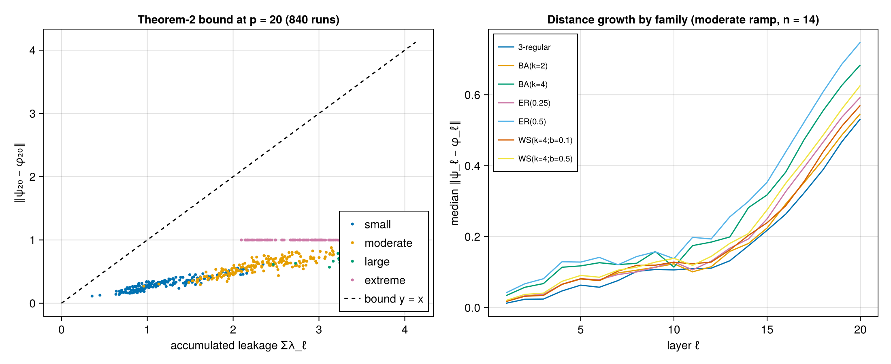

# 003 — Does accumulated leakage track the true-vs-proxy overlap deficit?

**Question:** For deep (p = 20) linear-ramp schedules, how tightly does the
accumulated per-layer leakage Σλ_ℓ bound the actual distance ‖ψ_p − φ_p‖
between the true and compressed trajectories (Theorem 2), across graph
families and ramp magnitudes?

**Answer: Yes — the bound holds with only 3–6× slack (median ≈ 4, never >10×),
accumulated leakage is a near-functional predictor of the actual trajectory
distance within each angle regime, and it ranks graph families by fidelity at
Spearman ρ ≈ 0.96–1.0 in 8 of 9 (n, ramp) cells.**

## Why this matters

Theorem 2 (‖ψ_p − φ_p‖ ≤ Σ_ℓ λ_ℓ) is the paper's quantitative link between
per-layer leakage and end-to-end proxy fidelity. If the bound is loose by >10×
systematically, it is true but vacuous and the paper leans on measured λ_ℓ
directly; if it is within a few ×, it justifies using cheap per-layer leakage
as the central diagnostic.

## Method

7 families × n ∈ {12, 14, 16} × 10 instances × 4 linear-ramp schedules
(small/moderate/large/extreme angle magnitudes), p = 20. For every layer we
record λ_ℓ, Σλ, ‖ψ_ℓ − φ_ℓ‖, |⟨ψ_ℓ|φ_ℓ⟩|, and ‖φ_ℓ‖ via
`compressed_qaoa_trajectory` (instance seeds shared with experiment 002).

## Result



- **Bound tightness:** slack Σλ / ‖ψ₂₀ − φ₂₀‖ has median 3.9–4.1 (max 5.8) for
  small/moderate/large ramps and 3.1 for extreme (where distance saturates at
  ≈ √2·‖φ‖). Never vacuous; Theorem 2 stays a headline result.
- **Σλ as predictor:** at fixed ramp regime, (Σλ, distance) points lie on a
  tight curve (left panel) — accumulated leakage predicts end-to-end fidelity
  nearly deterministically, much better than the worst-case bound suggests.
- **Family ranking (E1.3 preview):** family-level Spearman correlation between
  mean Σλ and mean fidelity deficit is 0.96–1.0 for all (n, ramp) cells except
  n=16/large (ρ = 0.36; overlaps there are partly decayed, spread only ~0.23 —
  the regime where the proxy is useless anyway).
- **New mechanistic hypothesis (H-density):** family-mean Σλ correlates with
  mean edge count m at Pearson 0.974 (moderate ramp, n=14): 3-regular (m=21,
  Σλ=1.92) < … < ER(0.5) (m=46, Σλ=3.04). **Density, not "ER-ness," is the
  first-order driver of compression error under ramp schedules** — ER(0.5)
  is actually the *worst*-compressing family tested. Theorem 3's weighted
  within-class variance should explain this (more edges → more cost classes →
  more room for within-class variation); to test in E2.1.

## Caveats

- Angles are shared across families in absolute terms; denser graphs see
  larger effective phases γ·c. Rescaling γ by m (as practitioners do) could
  absorb part of the density effect — the E2.1 (γ, β) sweep will separate
  "density at fixed angles" from "density after rescaling."
- Fidelity here is trajectory fidelity, not parameter-setting regret; the
  leakage ⇔ regret link is E1.3's job (instance seeds are shared with
  experiment 002 for exactly that purpose).
- n=16/large-ramp ranking breakdown noted above.

## Reproduce

```
JULIA_NUM_THREADS=auto julia --project research/experiments/003_leakage-vs-overlap/run.jl
```

Seed 20260612. Output: `results.csv` (long format, one row per layer).
Smoke test: prefix `E1_SMOKE=1`.
