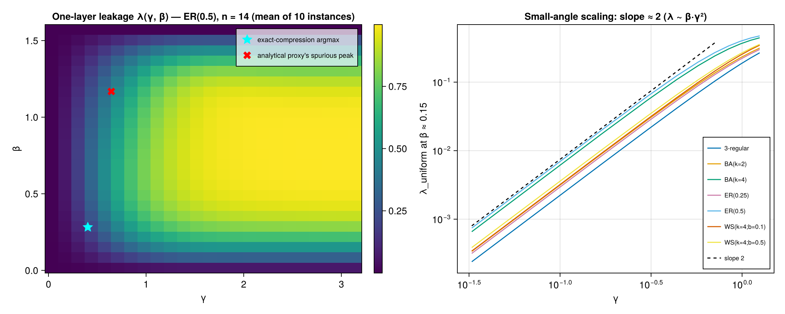

# 007 — Leakage anatomy over the (γ, β) plane

**Question:** How does one-layer leakage out of the cost-class subspace vary
with (γ, β) per graph family — and in particular, is the proxy's trust region
predictable from leakage alone (does the analytical proxy's dense-ER spurious
peak sit in a high-leakage region)?

**Answer: Leakage has a clean anatomy — λ ≈ const·β·γ²·m at small angles (a
provable cubic-order law: the O(βγ) term vanishes identically for MaxCut) and
the proxy-chosen optima sit in the low-leakage corner — but the analytical
proxy's spurious peak sits at only the 38th leakage percentile, so compression
leakage does NOT flag the model-error artifact (consistent with the two being
different error axes).**

## Why this matters

Three threads converge here:
1. The filter arc (exps 004–006) showed value/norm-based guards cannot repair
   the analytical proxy; if high *leakage* marks the regions where any
   homogeneous proxy is untrustworthy, leakage itself defines the guard —
   and it is model-independent and computable from instance data.
2. H-density (exp 003): leakage tracked edge count at fixed angles; a (γ, β)
   map lets us test whether rescaling γ by m absorbs the density effect.
3. Theorem 3 predicts the small-angle scaling of leakage; this sweep provides
   the data to check the perturbative regime, and is the paper's planned
   "anatomy of leakage" figure (Fig. 1 in the skeleton).

## Method

7 families × n ∈ {12, 14} × 10 instances (seeds shared with exps 002/004–006),
24×24 grid over γ ∈ (0, π], β ∈ (0, π/2]. Per grid point: λ_uniform (one-layer
leakage from |+⟩ⁿ) and η_F = sqrt(Σ_{c'} λ(c')²) over all attained cost-class
states (model-independent operator-leakage profile). All exact statevector
computation via `apply_phase_gate!`/`apply_x_mixer!` + projection; no
distribution arrays.

## Result



1. **A cubic-order small-angle law, λ ~ β·γ²** (log-log slopes: 0.98 in β,
   1.92 in γ). The reason the O(βγ) term is absent is an exact MaxCut
   identity, verified numerically to machine precision on random instances:

       Σ_{i=1}^{n} c(x ⊕ e_i) = (n − 4)·c(x) + 2m   for every bitstring x,

   (flipping bit i changes c by deg(i) − 2·cut_i(x), and Σ_i cut_i = 2c) —
   i.e. the distance-1 neighborhood cost-sum is itself a function of cost
   only, so the first-order mixer term never leaves the subspace. Leakage
   starts at the *third* order β·γ², which quantitatively explains the
   proxy's known small-γ accuracy. To be written up as a lemma in §3/§4.
2. **Density law confirmed and sharpened (H-density):** at small angles
   λ/(β·γ²·m) is constant to within ~±40% across all seven families — the
   first-order driver of compression error is the edge count m (equivalently,
   the cost spread), with family structure a second-order correction. Curves
   in the right panel are parallel and ordered by m.
3. **The naive trust-region idea fails — and that's consistent:** on ER(0.5)
   n=14, the analytical proxy's spurious peak (exp 004, γ≈0.64, β≈1.17) sits
   at the **38th percentile** of one-layer leakage (the exact-compression
   argmax sits at the 23rd). Compression leakage cannot flag the artifact
   because the artifact is *model* error — exps 002/004 already showed
   compression is benign there. The two error axes (compression vs model) are
   empirically independent, which is itself a central claim of the paper.

## Caveats

- λ_uniform is first-layer leakage from |+⟩ⁿ; deeper-layer leakage along a
  schedule was covered by exp 003.
- The ±40% residual in the density collapse is unmodeled family structure —
  Theorem 3's variance form should account for it (T2.0 target), but that
  derivation is not yet done.
- Grid resolution 24×24; the percentile statements are robust to this but
  exact peak locations are ±half a grid step.

## Reproduce

Figure: `julia --project research/experiments/007_leakage-anatomy/plot.jl`
Identity check: testset "MaxCut neighbor-cost identity" in
`test/test_subspace_compression.jl`.

## Reproduce

```
JULIA_NUM_THREADS=auto julia --project research/experiments/007_leakage-anatomy/run.jl
```

Seed 20260611. Output: `results.csv` (long format, one row per grid point).
Smoke test: prefix `E1_SMOKE=1`.
